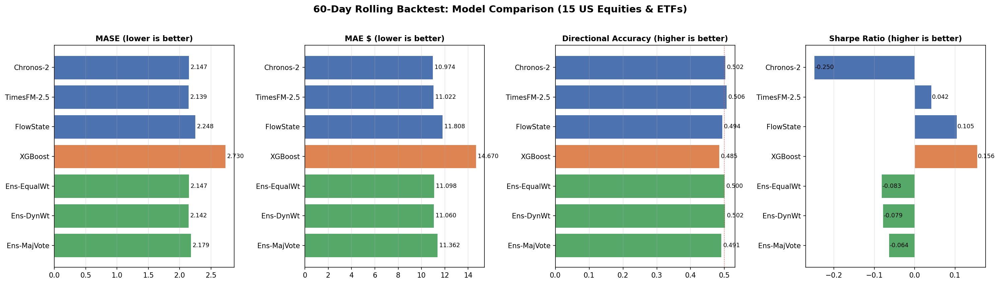
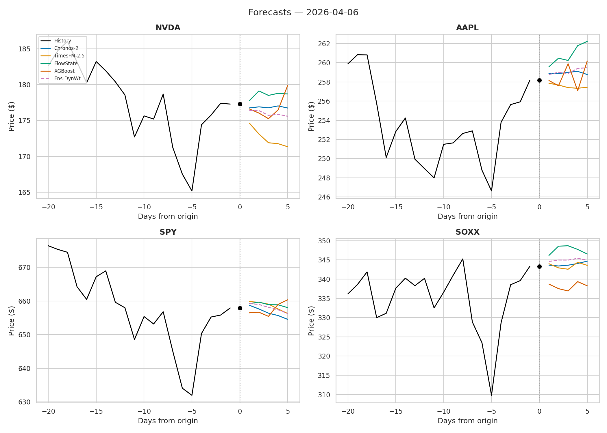

# fin-forecast-arena

**Benchmarking SOTA Time Series Foundation Models on Financial Data**

*First public head-to-head comparison of Chronos-2, TimesFM 2.5, and FlowState on US equities*

---

## What is this?

A rigorous evaluation framework that pits the latest time series foundation models against each other and a traditional ML baseline on real US equity and ETF data. All models predict 5 trading days ahead on 15 tickers, evaluated over a 60-day rolling backtest with proper walk-forward validation.

### Models tested

| Model | Params | Source | Type |
|---|---|---|---|
| [Chronos-2](https://huggingface.co/amazon/chronos-2) | 120M | Amazon | Probabilistic (21 sample paths) |
| [TimesFM 2.5](https://huggingface.co/google/timesfm-2.5-200m-pytorch) | 200M | Google | Point + quantile head |
| [FlowState](https://huggingface.co/ibm-granite/granite-timeseries-flowstate-r1) | 9.1M | IBM Granite | Flow-matching with 9 quantiles |
| XGBoost | ~50K | Baseline | Lag features, RSI, MACD, rolling stats |

Plus three ensemble methods combining the three foundation models:
- **Equal-weight average** of point forecasts
- **Dynamic-weighted average** (inverse-MAE over trailing 20 days)
- **Majority-vote direction** (2-of-3 agree on up/down)

### Tickers

**Semiconductors:** TSM, NVDA, AMD, INTC, ASML, AVGO, QCOM
**Mega-cap tech:** AAPL, MSFT, GOOGL, AMZN, META
**ETFs:** SPY, QQQ, SOXX

---

## Results

60-day rolling backtest, 252-day context window, 5-day forecast horizon, evaluated on all 15 tickers.

### Summary table

| Model | MAE ($) | RMSE ($) | MASE | Dir. Accuracy | Sharpe |
|---|---|---|---|---|---|
| **Chronos-2** | 10.97 | 12.44 | 2.147 | 50.2% | -0.25 |
| **TimesFM-2.5** | **11.02** | **12.52** | **2.139** | **50.6%** | +0.04 |
| **FlowState** | 11.81 | 13.36 | 2.248 | 49.4% | +0.10 |
| XGBoost | 14.67 | 16.36 | 2.730 | 48.5% | +0.16 |
| Ens-EqualWt | 11.10 | 12.60 | 2.147 | 50.0% | -0.08 |
| **Ens-DynWt** | **11.06** | **12.56** | **2.142** | **50.2%** | -0.08 |
| Ens-MajVote | 11.36 | 12.87 | 2.179 | 49.1% | -0.06 |

### Visual comparison



### Sample forecasts



---

## Key Findings

### 1. TimesFM 2.5 wins on accuracy, but barely

TimesFM-2.5 (200M params) edges out Chronos-2 (120M) by just 0.4% on MASE (2.139 vs 2.147). Both comfortably beat FlowState and XGBoost. On directional accuracy TimesFM also leads at 50.6% --- marginally above coin-flip, consistent with weak-form market efficiency on daily horizons.

### 2. FlowState's 9.1M parameters punch above their weight

FlowState achieves MASE of 2.248 with only **9.1M parameters** --- just 4.5% the size of TimesFM (200M). The accuracy gap is only 5% despite a 22x parameter disadvantage. On META specifically, FlowState actually beats both larger models (DirAcc 61.3% vs 53.0% / 57.3%). For resource-constrained deployments, FlowState offers a compelling accuracy-per-parameter ratio.

### 3. Ensembles match but don't beat the best single model

The dynamic-weighted ensemble (Ens-DynWt) achieves MASE of 2.142, virtually tied with TimesFM's 2.139 (0.13% gap). Ensembles reduce per-ticker variance --- fewer catastrophic misses on individual stocks --- but don't improve average performance. The majority-vote approach underperforms averaging, confirming that discretizing continuous forecasts to binary direction signals loses information.

### 4. All models struggle with high-volatility names

ASML (MAE $47-67) and META (MAE $19-29) are the hardest tickers across all models, driven by large absolute price levels and earnings-driven gaps. INTC is the easiest (MAE $2.50-2.67) due to its low, range-bound price.

### 5. No model generates a reliable trading signal

Sharpe ratios range from -0.25 to +0.16 across models --- none are statistically significant. Directional accuracy hovers near 50%. This is expected: daily equity returns are dominated by news and sentiment that no price-only model can anticipate.

---

## Metrics

| Metric | Definition |
|---|---|
| **MAE** | Mean Absolute Error in dollars |
| **RMSE** | Root Mean Squared Error in dollars |
| **MASE** | Mean Absolute Scaled Error vs. naive random-walk forecast |
| **Dir. Accuracy** | Fraction of forecast steps with correct up/down direction |
| **Sharpe** | Annualized Sharpe of a long/short strategy on 1-day-ahead signal |

---

## Project Structure

```
fin-forecast-arena/
├── data/
│   ├── fetcher.py           # Yahoo Finance downloader with parquet cache
│   └── cache/               # .parquet files (gitignored)
├── models/
│   ├── chronos2_model.py    # Chronos-2 wrapper
│   ├── timesfm_model.py     # TimesFM 2.5 wrapper
│   ├── flowstate_model.py   # FlowState wrapper
│   └── xgboost_model.py     # XGBoost with technical features
├── pipeline/
│   ├── ensemble.py          # 3 ensemble methods
│   └── daily_run.py         # Daily fetch → predict → evaluate → plot
├── evaluation/
│   ├── metrics.py           # MAE, RMSE, MASE, DirAcc, Sharpe
│   └── evaluator.py         # Rolling backtest harness
├── results/
│   ├── predictions/         # Daily prediction CSVs
│   ├── evaluations/         # Backtest & cumulative results
│   └── plots/               # Generated charts
├── setup_cron.sh            # Cron installer (weekdays 22:00 UTC)
├── requirements.txt
└── README.md
```

---

## Quick Start

```bash
# Clone
git clone https://github.com/<your-username>/fin-forecast-arena.git
cd fin-forecast-arena

# Environment
python3.11 -m venv venv
source venv/bin/activate
pip install -r requirements.txt

# TimesFM requires source install
git clone https://github.com/google-research/timesfm.git
pip install -e "./timesfm[torch]"

# Fetch data and run backtest
python data/fetcher.py
python evaluation/evaluator.py

# Or run the daily pipeline
python pipeline/daily_run.py

# Schedule daily runs (weekdays 5 PM EST / 22:00 UTC)
bash setup_cron.sh
```

---

## Tech Stack

| Layer | Technology |
|---|---|
| **Language** | Python 3.11 |
| **Deep learning** | PyTorch 2.10 (CPU) |
| **Foundation models** | Chronos-2 (Amazon), TimesFM 2.5 (Google), FlowState (IBM) |
| **Traditional ML** | XGBoost with hand-crafted technical indicators |
| **Data** | yfinance, pandas, parquet caching |
| **Evaluation** | scikit-learn, properscoring, custom rolling backtest |
| **Visualization** | matplotlib, seaborn |
| **Model hub** | Hugging Face Hub, Transformers |
| **Scheduling** | cron (weekday after-close) |

---

## Future Work

Planned additions include **Relational Deep Learning (RDL)** to model cross-asset dependencies via supply chain graphs, and integration with live trading systems.

Additional roadmap items:
- **Moirai 2.0** (Salesforce) integration once `uni2ts` supports PyTorch 2.10+
- Intraday (1-min, 5-min) forecast horizons
- Options-implied volatility as exogenous input
- Probabilistic calibration analysis (PIT histograms, CRPS)
- Multi-asset portfolio construction from ensemble forecasts

---

## License

MIT
